# Setting up the twitch extension on your twitch account

- Visit

[Twitch dev console](https://dev.twitch.tv/console/extensions)

- You will be led to this page where you select `Create Extension`

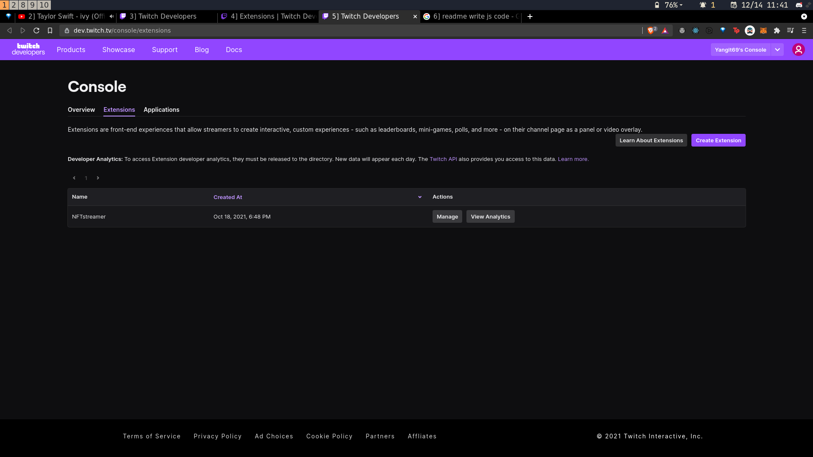

- Fill in some name

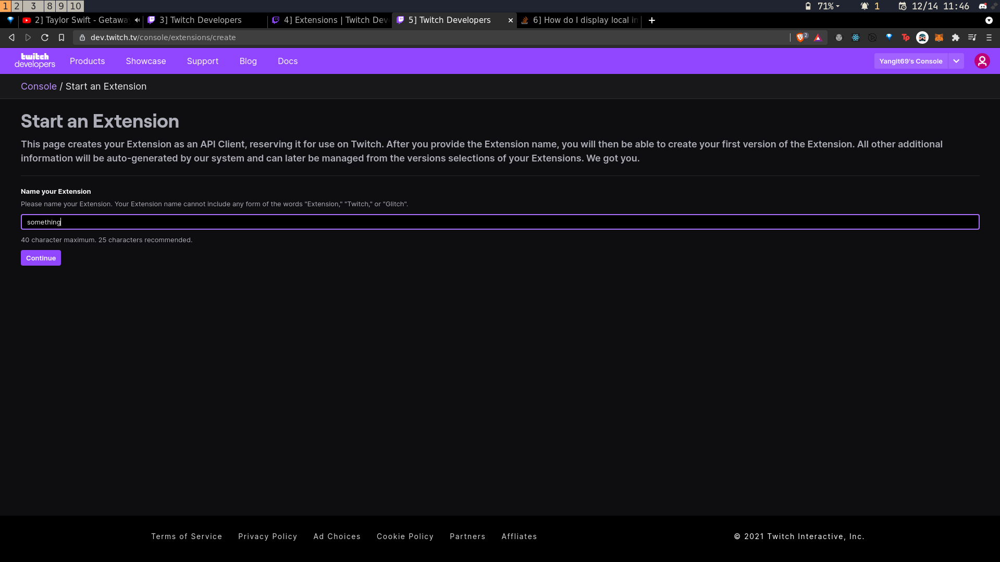

- Select all the extension types

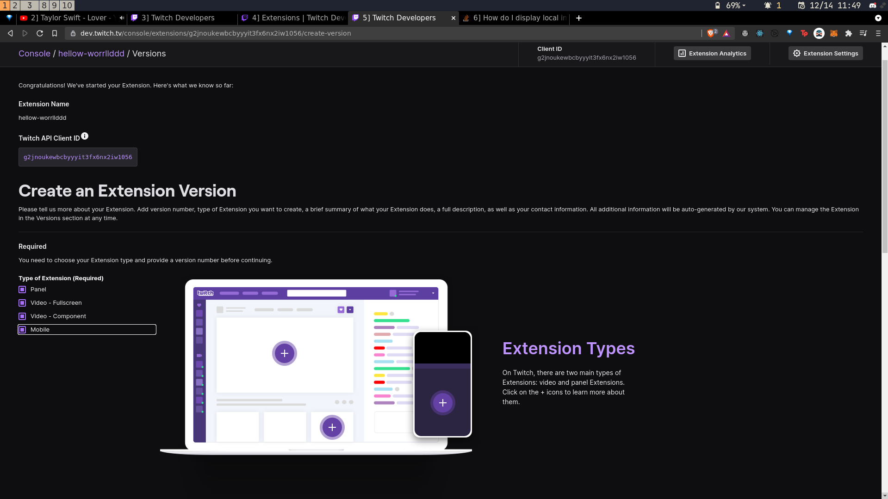

- Scroll all the way down and create extension


- Click Asset hosting and fill in the below url in the testing base uri

  ```
  https://twitch-extension-nft.netlify.app/
  ```

  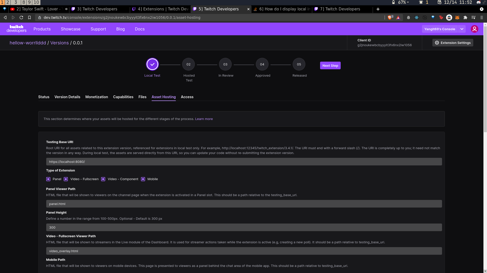

- Go all the way down and save changes

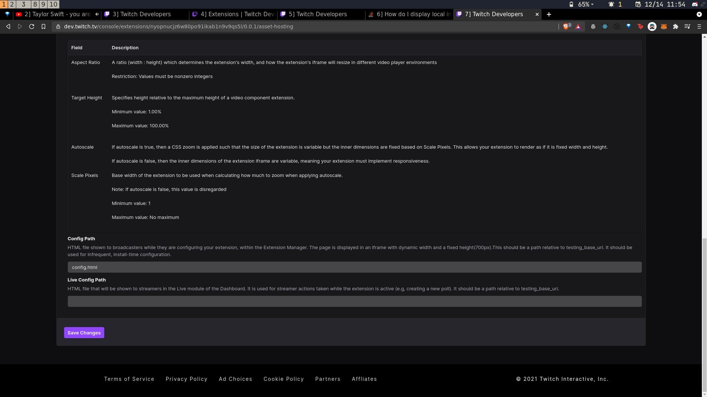

- Under Status tab click on View on twitch and install

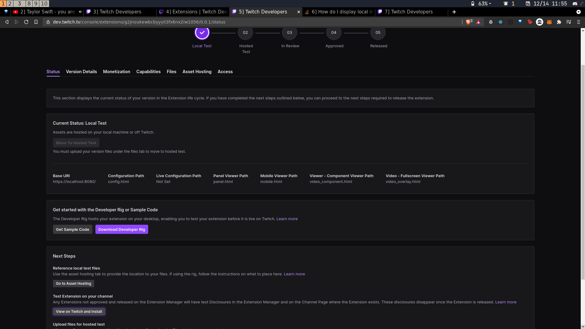

- Click on install

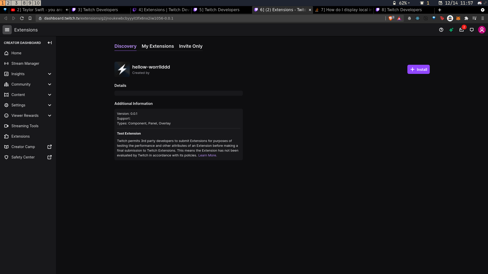

- Click on configure and close the empty window that pops up

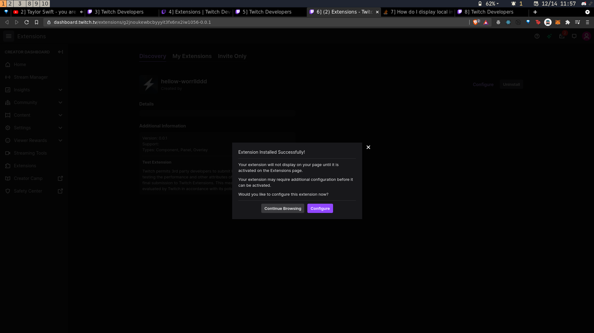

- Add the extension as a panel as shown below

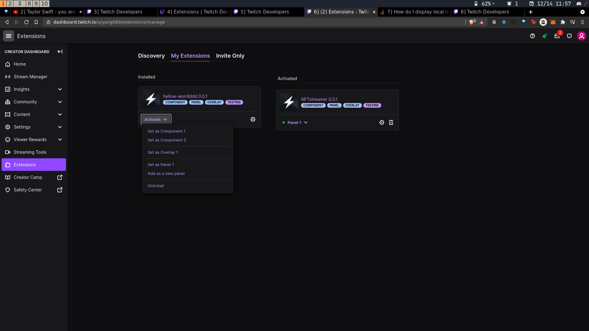

- Now just open your twitch channel and click on chat

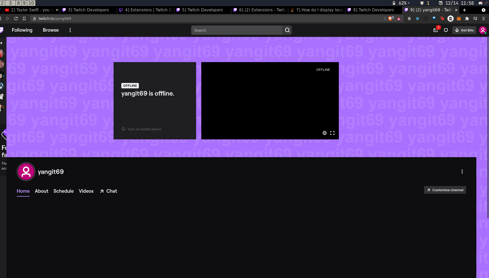

- The extension should be visible right below the stream

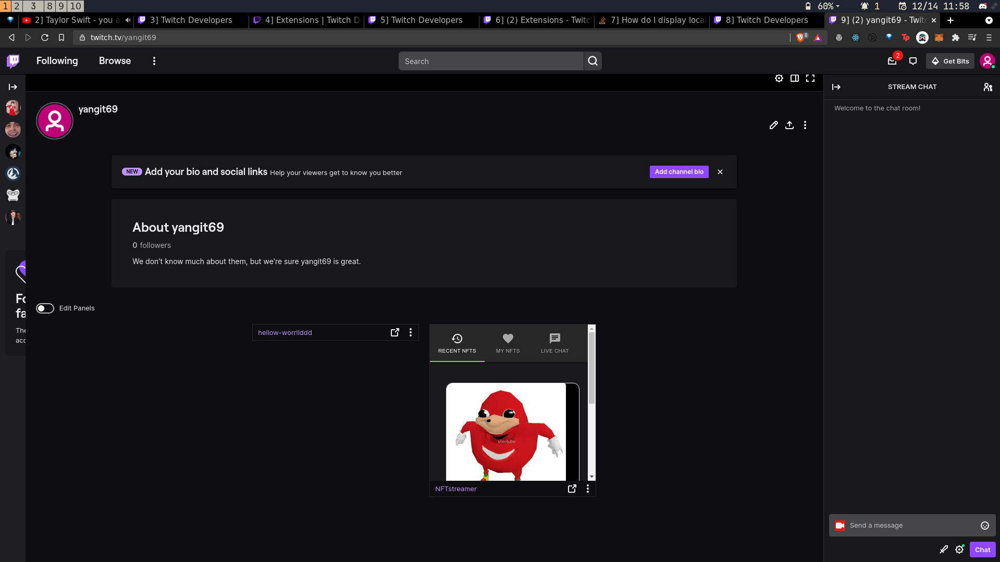
